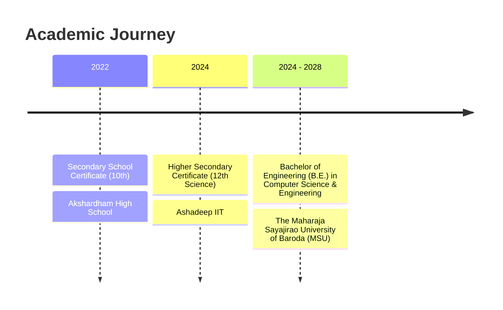

# Aryan Buha | Software Engineer & AI Systems Architect 🚀

<div align="center">

[](https://aryanbuha-portfolio.vercel.app/)
[](https://www.linkedin.com/in/aryan-buha-874a5434b/)
[](https://github.com/Aryanbuha890)
[](mailto:aryanbuha56@gmail.com)
[](https://wa.me/919313198911)

<br/>

[](https://react.dev/)
[](https://nextjs.org/)
[](https://tailwindcss.com/)
[](https://vitejs.dev/)
[](https://www.typescriptlang.org/)
[](https://python.org/)
[](LICENSE)

<br/>

> **Computer Science & Engineering Student @ The Maharaja Sayajirao University of Baroda (MSU)**  
> *Architecting resilient enterprise software, high-throughput full-stack platforms, autonomous multi-agent AI, and computer vision systems.*

</div>

> [!IMPORTANT]
> **Active GitHub Account:** Please note that my official and active GitHub account is **[@Aryanbuha890](https://github.com/Aryanbuha890)**. (My previous handle `Aryanbuha89` is deprecated/suspended).

---

## 🧭 Table of Contents

- [Executive Summary](#-executive-summary)
- [Major Achievements & Hackathon Honors](#-major-achievements--hackathon-honors)
- [Professional Experience](#-professional-experience)
- [Featured Flagship Projects](#-featured-flagship-projects)
  - [1. Jupiter Wealth CRM](#1-jupiter-wealth-crm)
  - [2. Kaashona Resort ERP](#2-kaashona-resort-erp)
  - [3. LogiMind AI (Maritime Command OS)](#3-logimind-ai-maritime-command-os)
  - [4. AgriForge AI](#4-agriforge-ai)
  - [5. Urban Intel AI](#5-urban-intel-ai)
  - [6. TerraForge Platform](#6-terraforge-platform)
  - [7. CityForge – Mumbai Pulse](#7-cityforge--mumbai-pulse)
  - [8. Agent Arena](#8-agent-arena)
- [Skills & Technology Matrix](#-skills--technology-matrix)
- [Education](#-education)
- [Portfolio Codebase Architecture](#-portfolio-codebase-architecture)
- [Local Setup & Deployment](#-local-setup--deployment)
- [Connect With Me](#-connect-with-me)

---

## 💡 Executive Summary

I am a Full Stack Software Engineer and AI/ML enthusiast pursuing a **B.E. in Computer Science and Engineering** at **The Maharaja Sayajirao University of Baroda (MSU)** (2024–2028).

- 🏢 **Enterprise SaaS & Systems:** Successfully delivered **Jupiter Wealth CRM** during an intensive 3-month Software Engineering Internship—architecting dynamic server-side 4-tier RBAC, 6-step digital KYC onboarding, and 13 automated test suites. Built **Kaashona Resort ERP**, automating real-time hospitality reservations, inventory, and GST invoicing.
- 🤖 **Applied AI & Autonomous Agents:** Engineered **LogiMind AI** (Hackverse Mumbai 6th Rank, Microsoft Hyderabad invite) using LangGraph multi-agent war rooms and YOLOv11 computer vision; built **AgriForge AI** (₹2.43 Lakh SSIP Gujarat Govt grant, IBM AI Challenge 2nd Rank).
- 🏆 **High-Pressure Execution:** Multiple national hackathon podium finishes including **NASA Space Apps Champions**, **DotSlash 9.0 Top 8 Finalist**, and **Ingenious 7.0 1st Runner Up**.
- 🌐 **Open Source:** Achieved **Global Rank #2** in **Elite Coders Summer of Code (ECSoC'26)**, unlocking all 6 contributor achievement badges.

---

## 🏆 Major Achievements & Hackathon Honors

| Honor / Standing | Event & Program | Organizing Body | Innovation / System Built |
| :--- | :--- | :--- | :--- |
| **🥈 2nd Rank Across Gujarat** | **IBM AI Innovation Challenge 2026** | IBM, CSRBOX® & iHUB Ahmedabad | **AgriForge AI**: AI-driven agricultural platform with localized crop diagnostics and market intelligence. |
| **🏅 6th Rank in India & Microsoft Office Invite** | **Hackverse Hackathon Mumbai** | Hackverse India & Microsoft | **LogiMind AI**: Maritime Port Safety & Command OS with LangGraph agents, YOLOv11 PPE vision & XGBoost predictive maintenance. |
| **🚀 Top 8 Finalist (out of 550+ Teams)** | **DotSlash 9.0 National Hackathon** | SVNIT Surat, ACM & ASHINE | **TerraForge Platform**: Offline-first environmental intelligence OS for climate risk and crop prediction. |
| **🥈 1st Runner Up (out of 180+ Teams)** | **Ingenious Hackathon 7.0** | Ahmedabad University | **Urban Intel AI**: Civic governance OS with 6 custom Random Forest models and private offline TinyLlama LLM. |
| **🏆 Champions (1st Place)** | **NASA Space Apps Challenge 2025** | NASA Space Apps (Vallabh Vidyanagar) | **CityForge – Mumbai Pulse**: Geospatial environmental analytics dashboard tracking heat islands and AQI. |
| **🌟 Global Rank #2** | **Elite Coders Summer of Code 2026** | Elite Coders (ECSoC'26) | Unlocked all 6 astronaut badges (Beginner to Master tier) contributing to production open-source codebases. |
| **💰 ₹2.43 Lakh Govt Grant** | **SSIP Research & Innovation Grant** | Government of Gujarat | Awarded research and innovation grant for smart agricultural empowerment and diagnostic technology. |

---

## 💼 Professional Experience

### 1. **Jupiter Wealth — Software Engineer Intern (WealthTech CRM)**
*Jun 2026 – Sep 2026 · 3 mos | Vadodara, Gujarat, India (Remote)*  
**Badges:** `WealthTech CRM` · `4-Tier RBAC` · `13 Test Suites` · `Next.js 16` · `Prisma ORM`

- **Complete Client Lifecycle:** Co-engineered the proprietary **Jupiter Wealth CRM** alongside Krushit Prajapati, Neel Prajapati, and Sumit Patel—covering lead generation, overdue follow-up queues, meeting tracking, client conversion, digital onboarding, operations handoff, portfolio review cycles, and executive MIS.
- **Dynamic 4-Tier Server-Side RBAC:** Architected strict hierarchical access control across **Admin**, **Cluster Head**, **Branch Head**, and **Relationship Manager (RM)** with query-level scoping, mutation audit trails, and soft-delete semantics (`deletedAt`).
- **6-Step Digital KYC Onboarding:** Engineered structured individual and entity onboarding flows, bank verification, nominee details, and authenticated document storage streaming.
- **Deduplicated Bulk CSV Engine:** Built an intelligent lead import pipeline with multi-phone deduplication using PostgreSQL GIN arrays and flexible column mapping.
- **Quality & Reliability:** Developed **13 automated test suites** spanning unit tests, API endpoints, pipelines, KYC validations, RBAC authorization, and bulk import flows.
- **Milestones:** Received Day 1 Appointment Letter → Successfully completed 3-Month Internship → Awarded Official Completion Certificate and Letter of Recommendation (LOR).

---

### 2. **Triotrack Solution — Software Engineer (Freelance)**
*Apr 2026 – Present | Surat, Gujarat, India · Remote*  
**Badges:** `Client Engineering` · `Custom Software` · `AI Automation` · `Full Stack`

- Designing and building end-to-end digital platforms, custom business software, and automated workflows for commercial clients.
- Leading client engagements from architectural discovery, requirement specifications, UI/UX prototyping to cloud deployment and maintenance.

---

### 3. **Code Vimarsh — Core Team Member (Club Lead)**
*Jan 2026 – Present | Vadodara, Gujarat, India*  
**Badges:** `Frontend Architecture` · `Community Lead` · `React.js` · `UI/UX`

- Contributing to the architecture, design, and continuous development of the official Code Vimarsh technical club web application.
- Collaborating with student developers to conduct technical workshops, hackathons, and open-source bootcamps.

---

### 4. **Elite Coders — Open Source Contributor (ECSoC'26)**
*Jul 2026 – Sep 2026 · Remote*  
**Badges:** `Global Rank #2` · `All 6 Tiers Unlocked` · `Open Source` · `Git`

- Selected as an open-source contributor for **Elite Coders Summer of Code 2026**.
- Achieved **Global Rank #2** across hundreds of contributors, resolving critical issues, optimizing build performance, and authoring reusable React components.
- Unlocked all 6 Astronaut badges: `Mission Register`, `Tier: Beginner`, `Tier: Hustler`, `Tier: Rookie`, `Tier: Elite`, and `Tier: Master`.

---

## 🚀 Featured Flagship Projects

### 1. **Jupiter Wealth CRM**
> **Enterprise Wealth-Management & Client Relationship Platform**  
> *Next.js 16 · React 19 · TypeScript · PostgreSQL · Prisma ORM · Tailwind CSS 4 · shadcn/ui · Zod*

- **Executive CRM Dashboard:** Real-time visibility into AUM inflow, active sales pipelines, fresh conversion metrics, and upcoming client review deadlines.
- **Frictionless 6-Step Digital Onboarding:** End-to-end KYC capturing investor profiles (Individual & Non-Individual), bank mandates, nominee allocations, and regulatory documents.
- **Hierarchical Scoping:** Built-in operational visibility structured by Cluster Head → Branch Head → RM branches.
- **Automated Validation:** Strict Zod schema enforcement across all client inputs, API payloads, and database queries.
- **Automated Testing:** 13 comprehensive test suites validating authorization, session tokens, and transaction pipelines.

---

### 2. **Kaashona Resort ERP**
> **Luxury Hospitality Management Operating System**  
> *React 19 · Node.js · Express.js · PostgreSQL · Tailwind CSS · PDF Generation Engine*

- **Multi-Category Suite Inventory:** Live status engine for Star A/B/C Villas, Treehouse Suites, and Heritage Rooms with real-time occupancy status.
- **Reservation & Tariff Engine:** Supports seasonal tariff matrices, lump-sum custom tour packages, date-range booking pickers, and instant confirmations.
- **Cashier Billing & Automated GST Invoices:** Instant reverse-tax calculations, automated printable PDF tax invoice generation, and Excel ledger exports.
- **Guest Ledger Audit Trail:** Complete historical registry of guest visits, advance payments (UPI/Cash/Card), vehicle IDs, and ID verification records.

---

### 3. **LogiMind AI (Maritime Command OS)**
> **Real-Time Maritime & Logistics Intelligence Platform**  
> *React 19 · FastAPI · YOLOv11 · LangGraph · XGBoost · ChromaDB · WebSockets*
> 
> 🏅 **6th Rank in India at Hackverse Mumbai (50+ Teams) & Microsoft Office Hyderabad Invite**

- **LangGraph Multi-Agent War Room:** Autonomous agent network coordinating Marine, Yard, Crane, and Gate operations simultaneously.
- **YOLOv11 Vision Safety Compliance:** Real-time RTSP/video stream analysis detecting PPE compliance (helmets, high-vis vests) and forbidden zone breaches.
- **Predictive Crane Maintenance:** XGBoost models analyzing live vibration, temperature, and motor telemetry to prevent port bottlenecks.
- **ChromaDB RAG Copilot:** Context-aware AI copilot serving real-time SOLAS, MARPOL, and IMDG maritime regulatory directives.

---

### 4. **AgriForge AI**
> **Comprehensive Smart Agricultural Empowerment Platform**  
> *React 19 · Node.js · FastAPI · EfficientNet · MongoDB · Multilingual LLM*
> 
> 💰 **₹2.43 Lakh SSIP Gujarat Govt Grant | 🥈 2nd Rank Across Gujarat (IBM AI Challenge 2026)**

- **AI Crop Disease Classification:** Computer vision models (EfficientNet) detecting leaf pathogens and nutritional deficiencies with treatment advisories.
- **Multilingual Generative Advisory:** Interactive AI guidance in 10+ Indian regional languages tailored for local farmers.
- **APMC Market Yard Pricing:** Real-time mandi rates, price trend forecasting, and weather-synchronized crop calendars.

---

### 5. **Urban Intel AI**
> **Offline-First Smart City Civic Governance OS**  
> *React.js · FastAPI · Supabase · Random Forest · Local TinyLlama LLM*
> 
> 🥈 **1st Runner Up at Ingenious Hackathon 7.0 (Ahmedabad University - 180+ Teams)**

- **6 Predictive Random Forest Models:** Multi-hazard forecasting predicting water scarcity index, traffic congestion, and air quality risk spikes.
- **Private Offline LLM:** Integrated TinyLlama running 100% locally on-device without cloud API dependencies or recurring costs.
- **Civic Action Center:** Automated escalation protocols for municipal authorities with simulated intervention strategies.

---

### 6. **TerraForge Platform**
> **Environmental Intelligence & Climate-Risk Forecasting OS**  
> *React.js · Node.js · Express.js · MongoDB · Local AI Models*
> 
> 🚀 **Top 8 Finalists Nationwide at DotSlash 9.0 (SVNIT Surat - 550+ Teams)**

- **Real-Time Climate Risk Telemetry:** Ingests atmospheric data to compute heat, flood, and drought risk indices.
- **Zero-Cloud Privacy:** Runs lightweight inference models on edge/local servers to ensure uninterrupted uptime during rural connectivity outages.
- **Multilingual Voice Assistant:** Speech-driven interface allowing rural farmers and ground workers to query environmental metrics effortlessly.

---

### 7. **CityForge – Mumbai Pulse**
> **Geospatial Environmental Intelligence Dashboard**  
> *React.js · Tailwind CSS · NASA Earth Observation (EO) APIs · GIS Overlays*
> 
> 🏆 **Champions & 1st Place at NASA Space Apps Challenge 2025 (Local Event)**

- **Urban Heat Island (UHI) Mapping:** Computes land surface temperatures to highlight critical urban thermal pockets across Mumbai.
- **Hydrological Risk Analytics:** Correlates rainfall data, lake water capacities, and catchment runoffs.
- **Interactive GIS Layers:** Visualizes real-time AQI overlays, green cover depletion, and infrastructure expansion trends.

---

### 8. **Agent Arena**
> **Autonomous Multi-Source Competitive Intelligence Agent**  
> *Python · LangChain · Scrapy · GenAI · Sentiment Analysis*

- **Autonomous Web Harvesters:** Asynchronous scraping pipeline crawling GitHub repositories, Reddit discussions, and Hacker News threads.
- **Memory-Augmented Reasoning:** Nested LangChain loops tracking emerging developer tooling, open-source adoption curves, and sentiment vectors.

---

## 🛠️ Skills & Technology Matrix

### 💻 Programming Languages


### 🌐 Frontend & UI Engineering


### ⚙️ Backend, Systems & APIs


### 🧠 Artificial Intelligence, Machine Learning & Vision


### 🗄️ Databases & ORM


### 🛠️ DevOps, Cloud & Testing


---

## 🎓 Education



- **The Maharaja Sayajirao University of Baroda (MSU)**  
  *Bachelor of Engineering (B.E.) in Computer Science and Engineering (CSE)* | `2024 – 2028`  
  *Focus:* Data Structures & Algorithms, Operating Systems, Database Management Systems, Computer Networks, Object-Oriented Design.
- **Ashadeep IIT**  
  *Higher Secondary Certificate (12th Science)* | `2024`  
  *Focus:* Advanced Mathematics, Physics, Chemistry, Analytical Problem Solving.
- **Akshardham High School**  
  *Secondary School Certificate (10th Grade)* | `2022`

---

## 🏗️ Portfolio Codebase Architecture

This portfolio is engineered as a high-performance single-page web application featuring cyberpunk/tactical aesthetic tokens, glassmorphism, animated GSAP/Framer Motion timelines, and real-time EmailJS contact compilation:

```
Aryanbuha890-Portfolio-1/
├── public/                     # Static assets, project media & certificates
│   ├── 13.png - 19.png        # Jupiter Wealth CRM dashboards, letters & LOR
│   ├── K1.png - K6.png        # Kaashona Resort ERP screens
│   ├── 1.png - 6.png          # ECSoC'26 Open Source Contributor Astronaut Badges
│   └── images/                # Hackathon certificates & architecture screenshots
├── src/
│   ├── components/
│   │   ├── Header.jsx         # Sticky glass floating tactical navigation
│   │   ├── Hero.jsx           # Cyberpunk glitch hero with dynamic terminal status
│   │   ├── About.jsx          # Interactive tabs: Skills, Experience, Education & Badges
│   │   ├── Projects.jsx       # Interactive technical projects with modal gallery views
│   │   ├── Portfolio.jsx      # Hackathon achievements with credential verification
│   │   ├── Contact.jsx        # Terminal console form powered by EmailJS & direct links
│   │   └── Footer.jsx         # System telemetry and operational status
│   ├── App.jsx                # Main orchestrator & smooth navigation state
│   ├── index.css              # Custom Tailwind CSS v4 directives & cyber effects
│   └── main.jsx               # React 19 / Vite mount entry point
├── index.html                 # Optimized HTML document with SEO meta headers
├── package.json               # Dependencies & scripts
└── vite.config.js             # Vite 5 + Tailwind CSS v4 compiler config
```

---

## ⚡ Local Setup & Deployment

### Prerequisites
- [Node.js](https://nodejs.org/) (v18.0.0 or higher recommended)
- `npm` or `pnpm` or `yarn`

### 1. Clone the Repository
```bash
git clone https://github.com/Aryanbuha890/Aryanbuha890-Portfolio.git
cd Aryanbuha890-Portfolio
```

### 2. Install Dependencies
```bash
npm install
```

### 3. Start Development Server
```bash
npm run dev
```
Open your browser and navigate to `http://localhost:5173`.

### 4. Build for Production
```bash
npm run build
```
To preview the production bundle locally:
```bash
npm run preview
```

---

## 📬 Connect With Me

I'm always open to discussing **Software Engineering opportunities**, **startup collaborations**, **open-source initiatives**, or **competitive hackathon team-ups**.

- 📧 **Email:** [aryanbuha56@gmail.com](mailto:aryanbuha56@gmail.com)
- 💼 **LinkedIn:** [linkedin.com/in/aryan-buha-874a5434b](https://www.linkedin.com/in/aryan-buha-874a5434b/)
- 🐙 **GitHub:** [github.com/Aryanbuha890](https://github.com/Aryanbuha890)
- 📱 **Phone / WhatsApp:** [+91 9313198911](https://wa.me/919313198911)
- 📍 **Location:** Gujarat, India
- 🌐 **Live Portfolio:** [aryanbuha-portfolio.vercel.app](https://aryanbuha-portfolio.vercel.app/)

<br/>

<div align="center">

```
┌─────────────────────────────────────────────────────────────┐
│  STATUS: OPEN TO HIGH-IMPACT OPPORTUNITIES & COLLABORATIONS │
└─────────────────────────────────────────────────────────────┘
```

**Designed & Engineered by Aryan Buha**  
*Built with React 19, Tailwind CSS v4, Framer Motion & Love.*

</div>
